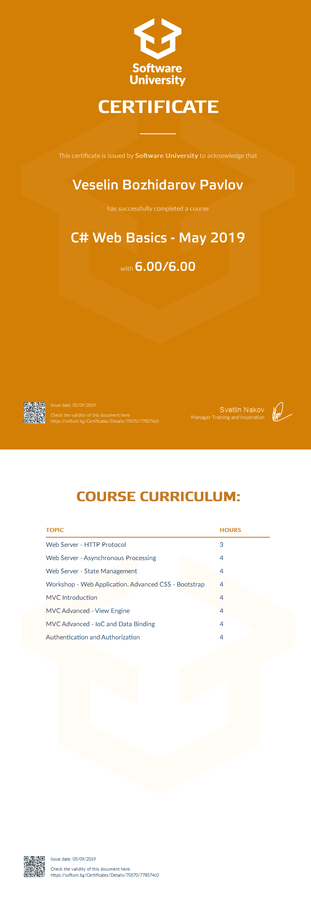

<a href="https://softuni.bg/trainings/courses" rel="Courses">  ![SoftUni logo][logo] <a/>

[logo]: http://innovationstarterbox.bg/wp-content/uploads/2016/05/Softuni_logo_trasparent.png "Logo Title Text 2"

---

# Course: C# Web Basics

## Topics:
01. Web Server - HTTP Protocol
02. Web Server - Asynchronous Processing
03. Web Server - State Management
04. Web Application. Advanced CSS - Bootstrap
05. MVC Introduction
06. MVC Advnced Part I
07. MVC Advnced Part II
08. Authentication and Authorization

## Certificate: 

